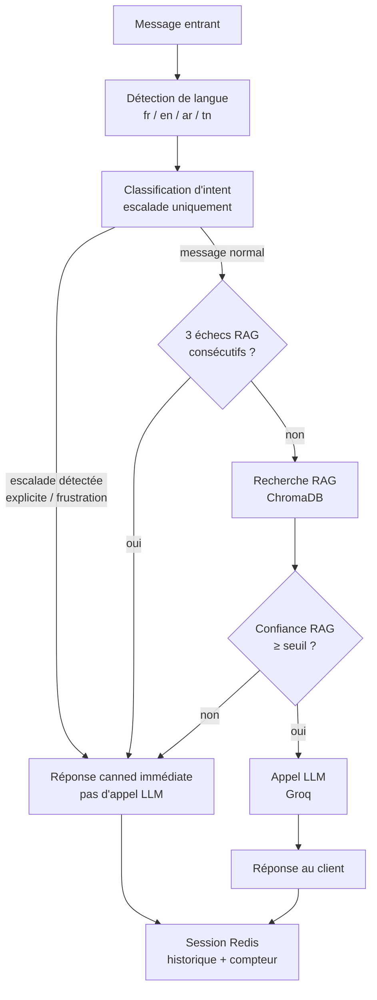

# Liss Strike — Chatbot IA Multicanal

Chatbot service client pour **Liss Strike**, boutique tunisienne
spécialisée dans l'électronique et les composants pour makers (cartes
programmables, capteurs, modules, outillage, impression 3D...).

Le bot comprend et répond en **français, anglais, arabe littéraire et
tunisien** (dialecte + arabizi), s'appuie sur un pipeline **RAG**
(Retrieval-Augmented Generation) branché sur la base de connaissances
réelle du magasin, et détecte de façon fiable les situations qui
doivent être transférées à un humain plutôt que traitées par l'IA.

## Aperçu



Quatre canaux d'entrée, un seul moteur (`dialogue_manager.handle_message`) :

| Canal | Endpoint |
|---|---|
| Web (HTTP) | `POST /chat/` |
| Web (temps réel) | `WS /ws/{client_id}` |
| WhatsApp Business Cloud API | `GET`/`POST /webhook/whatsapp` |
| Facebook Messenger | `GET`/`POST /webhook/messenger` |

## Fonctionnalités clés

- **Multilingue natif** — détection fr/en/ar/tn (arabe littéraire ET
  tunisien, écrit en lettres arabes ou en arabizi), réponse imposée
  dans la langue détectée plutôt que laissée au hasard du LLM.
- **RAG ancré dans la vraie base de connaissances** — le bot ne
  répond qu'à partir des documents indexés (politiques SAV, catalogue
  produits) ; consigne stricte de ne jamais halluciner un numéro de
  commande, un prix ou une date.
- **Escalade humaine fiable** — détection par règles déterministes
  (pas de ML probabiliste sur ce point précis) de 4 situations :
  - demande explicite ("je veux parler à un agent")
  - frustration envers le service (mécontentement + contexte service,
    pas confondu avec une critique produit normale)
  - boucle d'échecs RAG répétés (3 tentatives infructueuses de suite)
  - confiance RAG trop faible (score = 1 - distance cosinus du
    meilleur document trouvé < seuil calibré empiriquement) — évite de
    laisser le LLM répondre sur un contexte peu fiable plutôt que de
    risquer une hallucination
- **Garde-fou hors-sujet** — refuse poliment les questions sans
  rapport avec Liss Strike plutôt que de répondre avec les
  connaissances générales du LLM.
- **Multicanal** — même moteur conversationnel branché sur le web
  (HTTP + WebSocket), WhatsApp et Messenger, avec vérification de
  signature HMAC-SHA256 sur les deux webhooks Meta.
- **Interface de démonstration** — chat temps réel autonome
  (`/chat-demo`), sans framework, avec badges visuels d'escalade.

## Stack technique

| Composant | Technologie |
|---|---|
| API | FastAPI (ASGI, async) |
| LLM | Groq (`openai/gpt-oss-120b`, fallback `gpt-oss-20b`) — gratuit |
| Embeddings | `sentence-transformers/paraphrase-multilingual-MiniLM-L12-v2` (local, 384 dim) |
| Base vectorielle | ChromaDB |
| Session / compteur anti-boucle | Redis (fallback mémoire si indisponible) |
| Base relationnelle | PostgreSQL (SQLAlchemy async) |
| Détection de langue | `langdetect` + règles dédiées (arabe/tunisien) |
| Tests | pytest + pytest-asyncio |
| Conteneurisation | Docker Compose (Redis, PostgreSQL, ChromaDB, Adminer) |

## Structure du projet

```
app/
├── api/routes/          # chat, whatsapp, messenger, websocket, users
├── services/
│   ├── dialogue_manager.py    # orchestrateur central
│   ├── intent_classifier.py   # détection d'escalade (règles)
│   ├── language_detector.py   # détection fr/en/ar/tn
│   ├── session_manager.py     # sessions Redis + compteur anti-boucle
│   └── rag/                   # embeddings, ChromaDB, retriever, LLM
├── db/                   # SQLAlchemy (models, repositories)
├── schemas/              # Pydantic
└── config.py             # variables d'environnement centralisées

data/knowledge_base/      # politiques SAV + catalogue produits (source du RAG)
scripts/                  # ingestion de la knowledge base, génération de données
static/chat.html          # interface de démo
tests/                    # suite pytest (109 tests)
docs/                     # guides (ngrok/webhooks) + captures d'écran
```

## Installation

Prérequis : Python 3.13, Docker Desktop, une clé [Groq](https://console.groq.com/keys) gratuite.

```bash
# 1. Dépendances
python -m venv venv
venv\Scripts\activate          # Windows
pip install -r requirements.txt

# 2. Variables d'environnement
# Copier .env.example vers .env et renseigner au minimum GROQ_API_KEY

# 3. Services (Redis, PostgreSQL, ChromaDB, Adminer)
docker compose up -d

# 4. Indexer la base de connaissances dans ChromaDB
python scripts/ingest_knowledge_base.py

# 5. Lancer le serveur
uvicorn app.main:app --reload
```

- API + docs Swagger : http://localhost:8000/docs
- Interface de démo : http://localhost:8000/chat-demo
- Admin base de données : http://localhost:8080 (Adminer)

## Tests

```bash
pytest tests/ -v
```

109 tests couvrant la détection de langue, la classification
d'intent (escalade + non-régression sur faux positifs), le pipeline
RAG, l'orchestrateur complet (les 4 types d'escalade, appels réels
Groq/ChromaDB) et la structure de la base de connaissances.

## Documentation complémentaire

- [`docs/webhooks_ngrok_setup.md`](docs/webhooks_ngrok_setup.md) — exposer le serveur local en HTTPS et configurer les webhooks WhatsApp/Messenger dans l'interface Meta Developer.
- [`docs/screenshots/`](docs/screenshots/) — captures d'écran de l'interface de démo.

## Limites connues

Ce projet est un prototype fonctionnel et testé (109 tests
automatisés + tests manuels de bout en bout, y compris navigateur
réel et webhooks simulés au format exact Meta), mais il n'est **pas
prêt pour un vrai lancement en production** en l'état :

- **Aucun volet humain réel de l'escalade** : le bot annonce un
  transfert, mais rien ne notifie un agent ni ne lui permet de
  répondre — c'est un message canned suivi d'un flag en session, pas
  un vrai handoff.
- **WhatsApp/Messenger non testés avec de vrais comptes Meta** — le
  code respecte la documentation officielle et a été validé avec des
  requêtes simulées au format exact, mais pas encore en conditions
  réelles (quota, fenêtre de 24h WhatsApp, etc.).
- **Aucune authentification ni rate-limiting** sur les endpoints
  publics (`/chat/`, `/ws/{client_id}`).
- **`user_repository.py` / PostgreSQL** existent dans le code mais ne
  sont pas branchés au flux de conversation réel (l'état vit
  uniquement dans Redis).
- Le compteur anti-boucle (3 échecs RAG consécutifs) compte des
  *tentatives*, pas la *qualité* des réponses — une 3e question tout
  à fait légitime peut donc déclencher une escalade automatique.
- **Le seuil de confiance RAG chevauche largement le garde-fou
  hors-sujet du prompt système**, découvert lors des tests
  d'intégration : l'intention initiale était de rattraper les
  questions *dans le domaine* Liss Strike mais mal couvertes par le
  RAG. En pratique, sur ~18 questions candidates testées (français +
  tunisien, services obscurs variés), aucune question dans le domaine
  n'est descendue sous le seuil — le catalogue de ~11 000 produits est
  trop large. Seules des questions clairement hors domaine déclenchent
  ce mécanisme dans les faits (voir le détail dans `config.py` et
  `dialogue_manager.py`).

## Licence

Projet académique.
