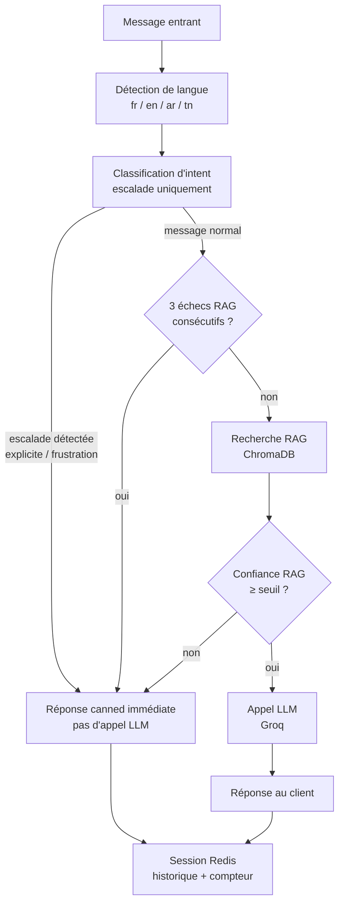

# Liss Strike — Chatbot IA Multicanal

Chatbot service client pour **Liss Strike**, boutique tunisienne
spécialisée dans l'électronique et les composants pour makers (cartes
programmables, capteurs, modules, outillage, impression 3D...).

Le bot comprend et répond en **français, anglais, arabe littéraire et
tunisien** (dialecte + arabizi), s'appuie sur un pipeline **RAG**
(Retrieval-Augmented Generation) branché sur la base de connaissances
réelle du magasin, et détecte de façon fiable les situations qui
doivent être transférées à un humain plutôt que traitées par l'IA.

## Aperçu


```mermaid
flowchart TD
    A[Message entrant] --> B[Détection de langue<br/>fr / en / ar / tn]
    B --> C[Classification d'intent<br/>escalade uniquement]
    C -->|escalade détectée<br/>explicite / frustration| D[Réponse canned immédiate<br/>pas d'appel LLM]
    C -->|message normal| L{3 échecs RAG<br/>consécutifs ?}
    L -->|oui| D
    L -->|non| E[Recherche RAG<br/>ChromaDB]
    E --> M{Confiance RAG<br/>≥ seuil ?}
    M -->|non| D
    M -->|oui| F[Appel LLM<br/>Groq]
    F --> H[Réponse au client]
    D --> I[Session Redis<br/>historique + compteur]
    H --> I
```

Quatre canaux d'entrée, un seul moteur (`dialogue_manager.handle_message`) :

| Canal | Endpoint |
|---|---|
| Web (HTTP) | `POST /chat/` |
| Web (temps réel) | `WS /ws/{client_id}` |
| WhatsApp Business Cloud API | `GET`/`POST /webhook/whatsapp` |
| Facebook Messenger | `GET`/`POST /webhook/messenger` |

## Fonctionnalités clés

- **Multilingue natif** — détection fr/en/ar/tn (arabe littéraire ET
  tunisien, écrit en lettres arabes ou en arabizi), réponse imposée
  dans la langue détectée plutôt que laissée au hasard du LLM.
- **RAG ancré dans la vraie base de connaissances** — le bot ne
  répond qu'à partir des documents indexés (politiques SAV, catalogue
  produits) ; consigne stricte de ne jamais halluciner un numéro de
  commande, un prix ou une date.
- **Escalade humaine fiable** — détection par règles déterministes
  (pas de ML probabiliste sur ce point précis) de 4 situations :
  - demande explicite ("je veux parler à un agent")
  - frustration envers le service (mécontentement + contexte service,
    pas confondu avec une critique produit normale)
  - boucle d'échecs RAG répétés (3 tentatives infructueuses de suite)
  - confiance RAG trop faible (score = 1 - distance cosinus du
    meilleur document trouvé < seuil calibré empiriquement) — évite de
    laisser le LLM répondre sur un contexte peu fiable plutôt que de
    risquer une hallucination
- **Garde-fou hors-sujet** — refuse poliment les questions sans
  rapport avec Liss Strike plutôt que de répondre avec les
  connaissances générales du LLM.
- **Multicanal** — même moteur conversationnel branché sur le web
  (HTTP + WebSocket), WhatsApp et Messenger, avec vérification de
  signature HMAC-SHA256 sur les deux webhooks Meta.
- **Interface de démonstration** — chat temps réel autonome
  (`/chat-demo`), sans framework, avec badges visuels d'escalade.

## Stack technique

| Composant | Technologie |
|---|---|
| API | FastAPI (ASGI, async) |
| LLM | Groq (`openai/gpt-oss-120b`, fallback `gpt-oss-20b`) — gratuit |
| Embeddings | `sentence-transformers/paraphrase-multilingual-MiniLM-L12-v2` (local, 384 dim) |
| Base vectorielle | ChromaDB |
| Session / compteur anti-boucle | Redis (fallback mémoire si indisponible) |
| Base relationnelle | PostgreSQL (SQLAlchemy async) |
| Détection de langue | `langdetect` + règles dédiées (arabe/tunisien) |
| Tests | pytest + pytest-asyncio |
| Conteneurisation | Docker Compose (Redis, PostgreSQL, ChromaDB, Adminer) |

## Structure du projet

```
app/
├── api/routes/          # chat, whatsapp, messenger, websocket, users
├── services/
│   ├── dialogue_manager.py    # orchestrateur central
│   ├── intent_classifier.py   # détection d'escalade (règles)
│   ├── language_detector.py   # détection fr/en/ar/tn
│   ├── session_manager.py     # sessions Redis + compteur anti-boucle
│   └── rag/                   # embeddings, ChromaDB, retriever, LLM
├── db/                   # SQLAlchemy (models, repositories)
├── schemas/              # Pydantic
└── config.py             # variables d'environnement centralisées

data/knowledge_base/      # politiques SAV + catalogue produits (source du RAG)
scripts/                  # ingestion de la knowledge base, génération de données
static/chat.html          # interface de démo
tests/                    # suite pytest (204 tests)
docs/                     # guides (ngrok/webhooks) + captures d'écran
```

## Installation

Prérequis : Python 3.13, Docker Desktop, une clé [Groq](https://console.groq.com/keys) gratuite.

```bash
# 1. Dépendances
python -m venv venv
venv\Scripts\activate          # Windows
pip install -r requirements.txt

# 2. Variables d'environnement
# Copier .env.example vers .env et renseigner au minimum GROQ_API_KEY
# et ADMIN_PASSWORD (sans lui, l'API refuse de démarrer, voir plus bas)

# 3. Services (Redis, PostgreSQL, ChromaDB, Adminer)
docker compose up -d

# 4. Indexer la base de connaissances dans ChromaDB
python scripts/ingest_knowledge_base.py

# 5. Lancer le serveur
uvicorn app.main:app --reload
```

- API + docs Swagger : http://localhost:8000/docs
- Interface de démo : http://localhost:8000/chat-demo
- Tableau de bord des conseillers (conversations transférées) : http://localhost:8000/admin
- Admin base de données : http://localhost:8080 (Adminer)

### Accès au tableau de bord des conseillers (`/admin`)

Les routes `/admin`, `/admin/escalations` et
`/admin/escalations/{id}/resolve` sont protégées par **HTTP Basic** : elles
exposent les identifiants (numéros WhatsApp…) et les questions des clients.
Définir dans `.env` :

```env
ADMIN_USERNAME=admin
ADMIN_PASSWORD=un-vrai-mot-de-passe
```

- `ADMIN_PASSWORD` est **obligatoire** : s'il est absent ou vide, l'API
  refuse de démarrer avec un message explicite (plutôt que d'exposer ces
  données). `ADMIN_USERNAME` vaut `admin` par défaut.
- En ouvrant http://localhost:8000/admin, le navigateur affiche sa propre
  invite de connexion.

⚠️ **Ce n'est qu'une première barrière** : un seul compte partagé entre
tous les conseillers, pas de vrais comptes ni de rôles, pas de journal de
qui a traité quoi. Et HTTP Basic transmet les identifiants simplement
encodés (base64), pas chiffrés : **HTTPS indispensable** en dehors d'une
machine locale.

### ⚠️ Ne jamais utiliser `docker compose down -v`

Le flag `-v` supprime les **volumes Docker nommés** — ça effacerait
définitivement les ~11 000 documents indexés dans ChromaDB (obligeant
à relancer `ingest_knowledge_base.py`, plusieurs minutes) ainsi que
les données PostgreSQL.

Pour arrêter les services sans rien perdre :

```bash
docker compose stop     # arrête les conteneurs, garde tout (recommandé)
docker compose down     # arrête ET supprime les conteneurs, mais les
                         # volumes nommés (chroma_data, postgres_data)
                         # survivent — sans -v, c'est sans risque aussi
```

`docker compose up -d` redémarre ensuite normalement avec les données
intactes, quelle que soit l'option utilisée pour arrêter — **tant que
`-v` n'a jamais été ajouté**.

## Tests

```bash
pytest tests/ -v
```

204 tests couvrant la détection de langue, la classification
d'intent (escalade, politesse + non-régression sur faux positifs), le
pipeline RAG (recherche hybride, reranking), l'orchestrateur complet
(les 4 types d'escalade, mémoire conversationnelle, compteur
anti-boucle, appels réels Groq/ChromaDB), la persistance PostgreSQL et
la structure de la base de connaissances.

## Documentation complémentaire

- [`docs/webhooks_ngrok_setup.md`](docs/webhooks_ngrok_setup.md) — exposer le serveur local en HTTPS et configurer les webhooks WhatsApp/Messenger dans l'interface Meta Developer.
- [`docs/screenshots/`](docs/screenshots/) — captures d'écran de l'interface de démo.
  - [`admin_1_liste.png`](docs/screenshots/admin_1_liste.png) — tableau de bord des conseillers (`/admin`) : 4 conversations transférées, avec la raison, la question du client et le temps d'attente (la 1re ligne montre une tentative d'injection HTML affichée comme du texte).
  - [`admin_2_apres_resolution.png`](docs/screenshots/admin_2_apres_resolution.png) — après un clic sur « Marquer traitée » : la conversation « Client mécontent » disparaît de la liste (4 → 3 en attente).

## Limites connues

Ce projet est un prototype fonctionnel et testé (204 tests
automatisés + tests manuels de bout en bout, y compris navigateur
réel et webhooks simulés au format exact Meta), mais il n'est **pas
prêt pour un vrai lancement en production** en l'état :

- **Aucun volet humain réel de l'escalade** : le bot annonce un
  transfert, mais rien ne notifie un agent ni ne lui permet de
  répondre — c'est un message canned suivi d'un flag en session, pas
  un vrai handoff.
- **WhatsApp/Messenger non testés avec de vrais comptes Meta** — le
  code respecte la documentation officielle et a été validé avec des
  requêtes simulées au format exact, mais pas encore en conditions
  réelles (quota, fenêtre de 24h WhatsApp, etc.).
- **Aucune authentification ni rate-limiting** sur les endpoints
  publics (`/chat/`, `/ws/{client_id}`).
- Le compteur anti-boucle ne compte plus que les échecs réels (les
  réponses où le bot dit ne pas avoir l'information), mais il les
  **reconnaît par mots-clés** : une formulation inédite du LLM n'est
  pas comptée (le client peut toujours demander un humain).
- **Recherche cross-lingue anglais → français imparfaite** : la base
  est rédigée en français, et certaines questions en anglais ne
  retrouvent pas la bonne politique (ex. « What is the warranty on
  programmable boards? » ne trouve pas la garantie ; « What is the
  warranty on a multimeter? » la trouve).
- **Tunisien en arabizi** : le contenu de la réponse est correct, mais
  le bot répond souvent en arabe littéraire au lieu de l'écriture
  latine (arabizi) utilisée par le client.
- **« 3D » pris pour de l'arabizi** : un chiffre collé à des lettres
  est un marqueur d'arabizi (« 3andi », « n7eb ») ; « imprimante 3D »
  dans une question en français fait donc répondre le bot en tunisien
  (même famille que les unités techniques « 12V », « 5A », déjà
  gérées).
- **Le seuil de confiance RAG chevauche largement le garde-fou
  hors-sujet du prompt système**, découvert lors des tests
  d'intégration : l'intention initiale était de rattraper les
  questions *dans le domaine* Liss Strike mais mal couvertes par le
  RAG. En pratique, sur ~18 questions candidates testées (français +
  tunisien, services obscurs variés), aucune question dans le domaine
  n'est descendue sous le seuil — le catalogue de ~11 000 produits est
  trop large. Seules des questions clairement hors domaine déclenchent
  ce mécanisme dans les faits (voir le détail dans `config.py` et
  `dialogue_manager.py`).

## Licence

Projet académique.
