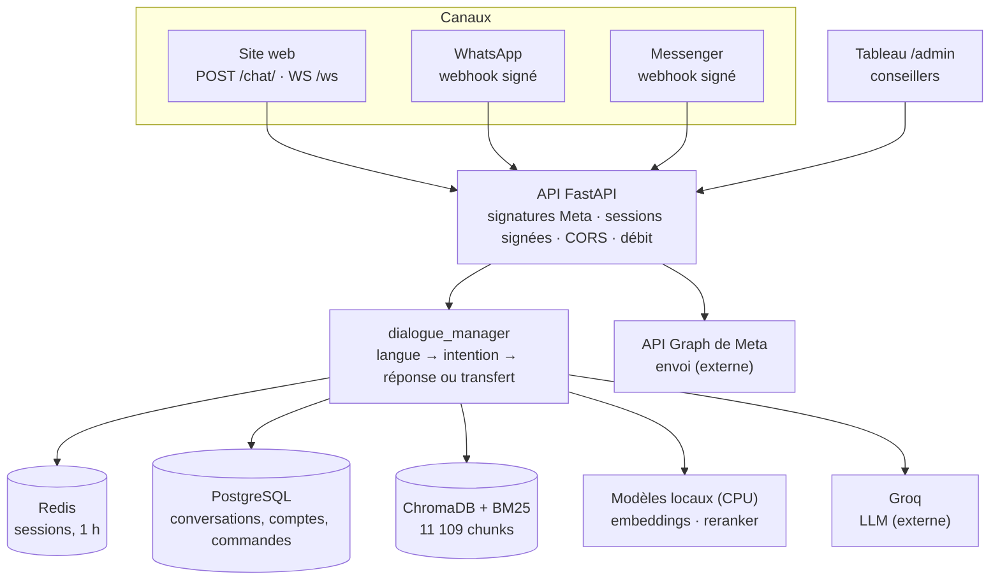
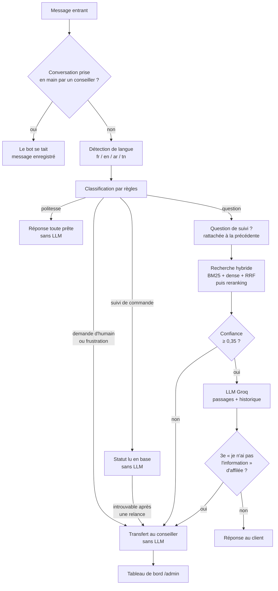

# Liss Strike — Assistant de service client multilingue

**Chatbot RAG qui répond en français, anglais, arabe et tunisien, et passe la main à un conseiller humain quand il le faut.**


[Fonctionnalités](#fonctionnalités) ·
[Architecture](#architecture) ·
[Démarrage rapide](#démarrage-rapide) ·
[Utilisation](#utilisation) ·
[Tests](#tests) ·
[Limites connues](#limites-connues)

---

## À propos

**Liss Strike** est une boutique tunisienne d'électronique pour *makers*
(cartes programmables, capteurs, modules, outillage). Son assistant :

- répond aux questions des clients **uniquement à partir de la base de
  connaissances** de la boutique (pipeline RAG : recherche des passages
  pertinents, puis rédaction de la réponse par un LLM qui n'a le droit
  d'utiliser que ces passages) ;
- comprend **4 façons d'écrire** : français, anglais, arabe littéraire et
  dialecte tunisien, en lettres arabes ou en arabizi (« 3andi mochkla ») ;
- sert **4 canaux** avec un seul moteur : site web (HTTP et WebSocket),
  WhatsApp et Messenger ;
- **transfère** la conversation à un conseiller humain dans 5 situations,
  et outille les conseillers avec un tableau de bord dédié.

> [!NOTE]
> **Projet académique — prototype.** La base de connaissances (politiques
> SAV et catalogue de 11 050 produits) et les commandes sont **fictives**,
> rédigées ou générées pour le projet. Le système n'est pas prêt pour une
> mise en production en l'état : voir [Limites connues](#limites-connues).

## Fonctionnalités

### Comprendre le message

| Brique | Ce qu'elle fait |
| --- | --- |
| **Détection de langue** | Règles dédiées à l'arabe et au tunisien (arabizi compris), `langdetect` pour le reste. La langue détectée est imposée au LLM pour la réponse. |
| **Classification par règles** | Sans LLM, donc déterministe et instantanée : demande d'un humain, frustration envers le *service* (« votre service est nul » transfère, « ce produit est nul » non), politesse, suivi de commande. |
| **Mémoire conversationnelle** | Les 6 derniers messages sont transmis au LLM ; une question de suivi (« et le délai ? ») est rattachée à la précédente pour la recherche. |

### Répondre sans inventer (RAG « Advanced »)

1. **Recherche hybride** : recherche sémantique (embeddings, ChromaDB) et
   recherche par mots-clés (BM25), fusionnées par *Reciprocal Rank Fusion*.
2. **Reranking** : un cross-encoder multilingue relit les 20 meilleurs
   candidats et garde les 4 plus pertinents.
3. **Génération** par un LLM (Groq) avec une consigne stricte : répondre
   uniquement à partir des passages trouvés, dire « je n'ai pas
   l'information » plutôt qu'inventer, refuser les questions hors sujet.

### Suivi de commande, sans LLM

- **Statut lu en base** (table `orders`), jamais généré par le LLM :
  numéro, statut, articles, total et date de livraison estimée, en fr, en,
  ar et tn.
- **Numéro `CMD-AAAA-NNNNN`** reconnu quelle que soit l'écriture (« cmd
  2026 00123 », casse, tirets ou espaces).
- **Une seule relance** si le numéro manque ou est introuvable, puis
  transfert à un conseiller.

### Transférer au bon moment (5 déclencheurs)

| Raison | Déclencheur | Appel au LLM |
| --- | --- | --- |
| `explicit` | Le client demande un humain | Non |
| `frustration` | Mécontentement envers le service | Non |
| `low_rag_confidence` | Confiance de la recherche sous le seuil (0,35) | Non |
| `repeated_rag_failure` | 3 réponses « je n'ai pas l'information » consécutives | Oui (réponses précédentes) |
| `order_tracking` | Commande toujours introuvable (ou sans numéro) après une relance | Non |

### Outiller les conseillers (`/admin`)

- **Liste des conversations transférées** : client, canal, raison,
  dernière question, temps d'attente ; notification du navigateur à chaque
  nouveau transfert.
- **Historique complet** et **réponse au client sur son canal d'origine**
  (WhatsApp, Messenger, ou chat du site s'il est encore connecté).
- **Prise en main** : dès la première réponse du conseiller, le bot se tait
  pour ce client. Il reprend après « Marquer traitée », ou après 1 h sans
  message du conseiller. Les réponses du conseiller rejoignent la mémoire
  du bot.
- **Un compte par conseiller** (mot de passe haché avec bcrypt), rôles
  `conseiller` et `admin` ; chaque réponse, prise en main et résolution est
  rattachée à son auteur.
- **Statistiques** (`/admin/statistiques`, sur 7, 30 ou 90 jours) : taux de
  conversations traitées sans conseiller, volumes par canal, par langue et
  par jour, réponses par type, transferts par raison, temps de réponse
  (médiane et 90e centile), et **questions sans réponse** : celles qui ont
  mené à un transfert « réponse non trouvée » ou à une réponse « je n'ai
  pas l'information », regroupées et comptées, à ajouter à la base de
  connaissances.
- **Prospects** (même page, export CSV) : clients qui se sont renseignés
  sur un produit, avec les produits d'intérêt (nom, prix), le nombre de
  questions, la dernière question, l'intention d'achat exprimée (prix,
  disponibilité, achat, dans les 4 langues) et le canal pour les
  recontacter. Déduits de l'historique (références produits citées par
  les réponses RAG), sans table ni saisie supplémentaires.

### Persistance et sécurité

- **Sessions** dans Redis (1 h) et **historique permanent** dans
  PostgreSQL, enregistré en arrière-plan sans retarder la réponse.
- **Webhooks Meta signés** (HMAC-SHA256), **sessions web attribuées et
  signées par le serveur**, CORS, limitation de débit par IP, journaux
  sans données personnelles ni secrets.

## Architecture

Les routes ne contiennent aucune logique métier : elles vérifient
l'appelant, puis passent le message au moteur unique,
`dialogue_manager.handle_message`.


```mermaid
flowchart TB
    subgraph canaux["Canaux"]
        WEB["Site web<br/>POST /chat/ · WS /ws"]
        WA["WhatsApp<br/>webhook signé"]
        MS["Messenger<br/>webhook signé"]
    end
    API["API FastAPI<br/>signatures Meta · sessions signées · CORS · débit"]
    DM["dialogue_manager<br/>langue → intention → réponse ou transfert"]
    ADMIN["Tableau /admin<br/>conseillers"]
    REDIS[("Redis<br/>sessions, 1 h")]
    PG[("PostgreSQL<br/>conversations, comptes, commandes")]
    CHROMA[("ChromaDB + BM25<br/>11 109 chunks")]
    MODELS["Modèles locaux (CPU)<br/>embeddings · reranker"]
    GROQ["Groq<br/>LLM (externe)"]
    META["API Graph de Meta<br/>envoi (externe)"]

    WEB & WA & MS --> API --> DM
    ADMIN --> API
    DM --> REDIS & PG & CHROMA
    DM --> MODELS & GROQ
    API --> META
```

### Parcours d'un message

Les vérifications s'enchaînent dans un ordre fixe ; le LLM n'est appelé
qu'en fin de parcours, pour une question dont la recherche a trouvé des
passages fiables.


```mermaid
flowchart TD
    A[Message entrant] --> P{Conversation prise<br/>en main par un conseiller ?}
    P -->|oui| Z[Le bot se tait<br/>message enregistré]
    P -->|non| B[Détection de langue<br/>fr / en / ar / tn]
    B --> C[Classification par règles]
    C -->|demande d'humain<br/>ou frustration| T[Transfert au conseiller<br/>sans LLM]
    C -->|politesse| R1[Réponse toute prête<br/>sans LLM]
    C -->|suivi de commande| O[Statut lu en base<br/>sans LLM]
    O -->|introuvable après<br/>une relance| T
    C -->|question| S[Question de suivi ?<br/>rattachée à la précédente]
    S --> R[Recherche hybride<br/>BM25 + dense + RRF<br/>puis reranking]
    R --> K{Confiance<br/>≥ 0,35 ?}
    K -->|non| T
    K -->|oui| L[LLM Groq<br/>passages + historique]
    L --> F{3e « je n'ai pas<br/>l'information »<br/>d'affilée ?}
    F -->|oui| T
    F -->|non| H[Réponse au client]
    T --> D[Tableau de bord /admin]
```

Chaque échange est conservé dans Redis (1 h) et PostgreSQL.

## Stack technique

| Composant | Technologie |
| --- | --- |
| API | FastAPI (async), Uvicorn |
| LLM | Groq : `openai/gpt-oss-120b`, repli sur `openai/gpt-oss-20b` |
| Embeddings | `paraphrase-multilingual-MiniLM-L12-v2` (sentence-transformers, local, 384 dimensions) |
| Recherche lexicale | BM25 (`rank-bm25`) |
| Reranker | `cross-encoder/mmarco-mMiniLMv2-L12-H384-v1` (multilingue) |
| Base vectorielle | ChromaDB 1.4.1 (image Docker épinglée par digest) |
| Sessions | Redis 7 (repli en mémoire si indisponible) |
| Base relationnelle | PostgreSQL 16, SQLAlchemy async, Alembic |
| Détection de langue | `langdetect` + règles dédiées arabe / tunisien |
| Évaluation | RAGas 0.4.3 (`scripts/evaluate_ragas.py`) |
| Tests | pytest, pytest-asyncio |
| Infrastructure | Docker Compose (PostgreSQL, Redis, ChromaDB, Adminer) |

## Résultats mesurés

Les chiffres ci-dessous viennent de
[`CHANGELOG_ADVANCED_RAG.md`](CHANGELOG_ADVANCED_RAG.md) et de
[`docs/evaluation/`](docs/evaluation/), où le protocole et ses limites
sont détaillés.

**Base de connaissances** : 11 109 chunks indexés (59 questions-réponses
de politiques SAV et e-commerce, 11 050 produits).

**Évaluation RAGas, Basic RAG contre Advanced RAG** (22 questions notées
en fr, en, ar et tn, juge `gpt-oss-20b`) :

| Métrique | Basic RAG | Advanced RAG |
| --- | --- | --- |
| Context Precision | 0,645 | **0,913** |
| Context Recall | 0,599 | **0,800** |
| Faithfulness | 0,532 | **0,689** |
| Answer Relevancy | 0,485 | **0,600** |
| Source attendue dans le top 4 | 77 % | **95 %** |

Le gain porte sur le français et l'anglais ; **l'arabe régresse** avec le
reranker (Context Recall 0,92 → 0,55). Échantillon réduit (3 à 4
questions en arabe et en tunisien) : ce sont des tendances, pas des
mesures statistiquement solides.

**Latences** (CPU, sans GPU) :

| Mesure | Valeur |
| --- | --- |
| Recherche Advanced (hybride + reranking), médiane sur 9 questions | 1 084 ms (max 1 505 ms) |
| dont reranking des 20 candidats | 883 ms (médiane) |
| Réponse RAG de bout en bout, scénario de démo vérifié | 1,2 à 1,9 s |
| Politesse et transfert explicite (sans LLM), même scénario | 7 à 22 ms |

## Démarrage rapide

### Prérequis

- Python 3.13
- Docker Desktop
- Une clé API [Groq](https://console.groq.com/keys) (offre gratuite)

### Installation

```bash
# 1. Dépendances
python -m venv venv
venv\Scripts\activate              # Windows ; Linux/macOS : source venv/bin/activate
pip install -r requirements.txt

# 2. Configuration : copier le modèle, puis renseigner au minimum
#    GROQ_API_KEY et ADMIN_PASSWORD (voir le tableau ci-dessous)
cp .env.example .env

# 3. Services : PostgreSQL, Redis, ChromaDB, Adminer
docker compose up -d

# 4. Schéma de la base, puis indexation de la base de connaissances (~11 min sur CPU)
alembic upgrade head
python scripts/ingest_knowledge_base.py
python scripts/seed_demo_orders.py   # optionnel : commandes fictives CMD-2026-00101 à 00105

# 5. Lancement
uvicorn app.main:app --reload
```

Au premier lancement, les modèles d'embeddings et de reranking sont
téléchargés depuis Hugging Face (environ 470 Mo pour le reranker). Si le
téléchargement reste bloqué, définir `HF_HUB_DISABLE_XET=1`.

### Configuration

Toutes les variables sont décrites dans [`.env.example`](.env.example).
Les principales :

| Variable | Requise | Rôle |
| --- | --- | --- |
| `GROQ_API_KEY` | **Oui** | Clé de l'API Groq (génération des réponses) |
| `ADMIN_USERNAME`, `ADMIN_PASSWORD` | **Oui**, au premier démarrage | Création du premier compte admin de `/admin` ; sans compte en base ni mot de passe, l'API refuse de démarrer |
| `DATABASE_URL`, `REDIS_URL`, `CHROMA_HOST`, `CHROMA_PORT` | Non | Adresses des services (valeurs adaptées à `docker compose`) |
| `WHATSAPP_PHONE_NUMBER_ID`, `WHATSAPP_ACCESS_TOKEN`, `WHATSAPP_VERIFY_TOKEN` | Pour WhatsApp | Identifiants Meta du canal WhatsApp |
| `WHATSAPP_APP_SECRET` | **Oui** si WhatsApp est configuré | Vérification des signatures Meta ; sans lui, l'API refuse de démarrer |
| `MESSENGER_PAGE_ACCESS_TOKEN`, `MESSENGER_VERIFY_TOKEN` | Pour Messenger | Identifiants Meta du canal Messenger |
| `MESSENGER_APP_SECRET` | **Oui** si Messenger est configuré | Vérification des signatures Meta ; sans lui, l'API refuse de démarrer |
| `CORS_ALLOWED_ORIGINS` | Non | Origines web autorisées (défaut : `localhost:8000` et `127.0.0.1:8000`) |
| `WS_SESSION_SECRET` | Recommandée | Clé de signature des sessions web ; vide = clé aléatoire à chaque démarrage |
| `RAG_RETRIEVAL_MODE` | Non | `advanced` (défaut), `hybrid` ou `basic` |
| `RAG_CONFIDENCE_THRESHOLD` | Non | Seuil de confiance sous lequel la question est transférée (défaut : 0,35) |
| `RATE_LIMIT_CHAT`, `RATE_LIMIT_WS_MESSAGES`, `RATE_LIMIT_WS_CONNECTIONS`, `RATE_LIMIT_USERS` | Non | Limites de débit par adresse IP |
| `RATE_LIMIT_LOGIN_FAILURES` | Non | Échecs de connexion tolérés avant blocage (défaut : 5 en 15 minutes, par IP et par identifiant) |
| `SQL_ECHO` | Non | Journal SQL, pour déboguer uniquement (désactivé par défaut) |

> [!WARNING]
> **Ne jamais utiliser `docker compose down -v`.** L'option `-v` supprime
> les volumes Docker : la base de connaissances indexée dans ChromaDB
> (environ 11 min pour la reconstruire) et toutes les données PostgreSQL.
>
> ```bash
> docker compose stop     # arrête les conteneurs, garde tout (recommandé)
> docker compose down     # supprime les conteneurs, garde les volumes (chroma_data, postgres_data)
> ```

## Utilisation

### Interfaces

| Adresse | Rôle |
| --- | --- |
| <http://localhost:8000/chat-demo> | Interface de démonstration (chat en temps réel) |
| <http://localhost:8000/admin> | Tableau de bord des conseillers (identifiants requis) |
| <http://localhost:8000/admin/statistiques> | Statistiques, questions sans réponse et prospects (identifiants requis) |
| <http://localhost:8000/docs> | Documentation interactive de l'API (Swagger) |
| <http://localhost:8080> | Adminer (administration PostgreSQL) |

### Points d'entrée de l'API

| Canal / usage | Route |
| --- | --- |
| Web (HTTP) | `POST /chat/` |
| Web (temps réel) | `GET /chat/session` (identifiant signé), puis `WS /ws/{client_id}?signature=…` |
| WhatsApp Business Cloud API | `GET` / `POST /webhook/whatsapp` |
| Facebook Messenger | `GET` / `POST /webhook/messenger` |
| Conseillers | `GET /admin`, `GET /admin/me`, `GET /admin/stats?days=30`, `GET /admin/leads`, `GET /admin/leads.csv`, `GET /admin/escalations`, `GET /admin/escalations/{id}/messages`, `POST /admin/escalations/{id}/reply`, `POST /admin/escalations/{id}/resolve` |
| Comptes conseillers (rôle admin) | `GET` / `POST /admin/agents`, `POST /admin/agents/{id}/deactivate`, `/activate`, `PUT /admin/agents/{id}/password` |
| Utilisateurs (rôle admin) | `/users/` |
| Supervision | `GET /health` |

### Exemple : `POST /chat/`

Le premier message ouvre une session : le serveur attribue un
`session_id` et renvoie sa `session_signature`.

```bash
curl -X POST http://localhost:8000/chat/ \
  -H "Content-Type: application/json" \
  -d '{"message": "Quels sont les frais de livraison ?"}'
```

Pour continuer la conversation, renvoyer les deux valeurs reçues ; un
`session_id` sans signature valide est refusé (403).

```bash
curl -X POST http://localhost:8000/chat/ \
  -H "Content-Type: application/json" \
  -d '{"message": "Et le délai ?", "session_id": "<session_id>", "session_signature": "<session_signature>"}'
```

La réponse contient aussi l'intention détectée, la confiance, les sources
consultées, le temps de traitement et, le cas échéant, la raison du
transfert.

**Démonstration** : un scénario vérifié en 8 étapes, une checklist de
démarrage et une transcription de secours sont dans
[`docs/demo/`](docs/demo/).

## Guides de configuration

<details>
<summary>Comptes des conseillers (/admin, /users/)</summary>

Les routes `/admin/…` exposent les identifiants des clients (numéros
WhatsApp…) et leurs questions ; les routes `/users/` permettent de
lister, créer, modifier et désactiver leurs comptes. Chaque conseiller a
**son propre compte** (table `agents`, mot de passe haché avec bcrypt),
vérifié en **HTTP Basic** :

| Rôle | Accès |
| --- | --- |
| `conseiller` | `/admin` : liste, historique, réponse au client, prise en main, « Marquer traitée » |
| `admin` | Tout ce qui précède, plus `/users/` et la gestion des comptes conseillers (`/admin/agents`) |

**Premier compte** : au démarrage, si aucun compte n'existe, un compte
**admin** est créé à partir de `ADMIN_USERNAME` et `ADMIN_PASSWORD` :

```env
ADMIN_USERNAME=admin
ADMIN_PASSWORD=un-vrai-mot-de-passe
```

- Ces deux variables ne servent **qu'à cette création** : ensuite, les
  comptes vivent en base, et modifier `ADMIN_PASSWORD` dans `.env` n'a
  plus d'effet (changer le mot de passe par l'API, ci-dessous). L'API
  refuse de démarrer si aucun compte n'existe et que `ADMIN_PASSWORD`
  est absent.
- **Gestion des comptes** (rôle `admin`, depuis `/docs` ou curl ; pas
  d'écran dédié) : `GET` / `POST /admin/agents` (lister, créer),
  `POST /admin/agents/{id}/deactivate` et `/activate`,
  `PUT /admin/agents/{id}/password`. Le dernier admin actif ne peut pas
  être désactivé. Mot de passe : 8 caractères minimum, 72 octets
  maximum (limite de bcrypt).
- **Traçabilité** : chaque réponse enregistre le conseiller qui l'a
  envoyée (affiché dans l'historique de `/admin`) ; la prise en main et
  « Marquer traitée » enregistrent aussi leur auteur. Un compte
  désactivé ne peut plus se connecter, mais son historique est conservé.
- Le navigateur affiche sa propre invite de connexion à l'ouverture de
  `/admin` ; l'en-tête indique le conseiller connecté. HTTP Basic n'a pas
  de vraie déconnexion : pour changer de compte, fermer le navigateur.

> [!IMPORTANT]
> Avec HTTP Basic, les identifiants sont transmis encodés (base64), non
> chiffrés : **HTTPS est indispensable** en dehors d'une machine locale.

</details>

<details>
<summary>Origines autorisées (CORS)</summary>

Seules les origines listées dans `CORS_ALLOWED_ORIGINS` (séparées par des
virgules) peuvent appeler l'API depuis un navigateur. Sans cette
variable, ce sont `http://localhost:8000` et `http://127.0.0.1:8000`.
La même liste s'applique au WebSocket `/ws/{client_id}` : une connexion
dont l'en-tête `Origin` n'y figure pas (ou qui n'en a pas) est fermée
avec le code 1008.

- `/chat-demo` et `/admin` ouverts en local (`localhost:8000` ou
  `127.0.0.1:8000`) : aucune configuration nécessaire.
- Pour une page ouverte depuis une autre adresse, **y compris
  `/chat-demo` exposé via ngrok** (son WebSocket envoie alors l'origine
  ngrok), ajouter cette origine exacte (schéma, domaine, port, sans `/`
  final) :

```env
CORS_ALLOWED_ORIGINS=http://localhost:8000,https://xxxx.ngrok-free.app
```

</details>

<details>
<summary>WhatsApp en conditions réelles</summary>

Testé de bout en bout avec un vrai téléphone : message reçu par le
webhook (signature vérifiée), réponse du bot générée puis envoyée par
l'API Graph et reçue sur WhatsApp. Configuration utilisée : **numéro de
test fourni par Meta**, un seul destinataire autorisé, serveur local
exposé par ngrok (voir
[`docs/webhooks_ngrok_setup.md`](docs/webhooks_ngrok_setup.md)).

Conditions nécessaires, en plus de l'URL du webhook, du jeton de
vérification et de l'abonnement au champ `messages` dans l'application
Meta :

- **`WHATSAPP_APP_SECRET`** : le secret de l'application Meta, recopié
  exactement (32 caractères hexadécimaux). Valeur erronée : chaque
  message reçu est rejeté en 403 (signature invalide). **Absent** alors
  que le canal est configuré (`WHATSAPP_PHONE_NUMBER_ID`,
  `WHATSAPP_ACCESS_TOKEN` ou `WHATSAPP_VERIFY_TOKEN`) : l'API **refuse de
  démarrer** ; et sans lui, le webhook refuse toute requête (aucun
  message n'est jamais accepté sans signature vérifiée).
- **Application abonnée au compte WhatsApp Business (WABA)** : étape
  distincte des champs webhook de l'application, faite par l'API Graph
  (`POST /{id-du-WABA}/subscribed_apps`, vérifiable par un `GET` sur la
  même adresse). Sans elle, les messages réels n'arrivent jamais au
  webhook, alors que le bouton « Test » du tableau de bord fonctionne.
- **`WHATSAPP_ACCESS_TOKEN`** : jeton de l'application, avec la
  permission `whatsapp_business_messaging` ; **`WHATSAPP_PHONE_NUMBER_ID`** :
  identifiant du numéro qui envoie.
- **En développement** : le numéro de test ne peut écrire qu'aux
  destinataires ajoutés **et validés** dans la configuration de l'API.
  Jeton invalide ou destinataire non autorisé : erreur Meta `131005`
  (« Access denied »), réponse du bot non délivrée.

Limites actuelles :

- **Jeton d'accès temporaire** (environ 24 h) : passé ce délai, les
  réponses ne partent plus. Un utilisateur système avec jeton permanent
  est nécessaire pour un usage durable (pas encore fait).
- **API Graph en version `v18.0`** : ancienne mais fonctionnelle ; la
  mise à jour vers une version récente n'est pas encore faite.

</details>

## Tests

```bash
pytest tests/                        # suite complète : 566 tests, ~2 min 30
pytest tests/ -m "not integration"   # 441 tests unitaires, ~15 s, sans aucun service
pytest tests/ -m integration         # 125 tests d'intégration
```

Les tests couvrent la détection de langue, la classification (escalade,
politesse, faux positifs), la recherche hybride et le reranking, la
mémoire conversationnelle, le compteur de boucle RAG, l'orchestrateur
complet (les 5 types de transfert), le suivi de commande, la persistance
PostgreSQL, le tableau de bord `/admin` (historique, réponse au client,
prise en main), l'authentification de `/admin` et `/users/`, CORS et
l'origine du WebSocket, les signatures (webhooks Meta, sessions web), la
limitation de débit, les journaux et la structure de la base de
connaissances.

- **Tests unitaires** : ni Docker, ni clé Groq, ni modèle téléchargé.
  C'est la partie à lancer en intégration continue.
- **Tests d'intégration** (marqueur `integration`) : ils ont besoin des
  services (`docker compose up -d`), d'une base de connaissances indexée
  et d'une clé Groq, ou chargent les modèles d'embeddings et de
  reranking ; sans ces services, ils sont ignorés (*skipped*). Un test
  qui utilise une fixture de base de données est marqué automatiquement
  (voir [`tests/conftest.py`](tests/conftest.py)).
- Certains tests d'intégration appellent réellement Groq (consommation du
  quota gratuit) et écrivent des conversations dans la base PostgreSQL
  locale ; [`scripts/cleanup_test_data.py`](scripts/cleanup_test_data.py)
  les supprime.

## Structure du projet

```text
app/
├── main.py                    # application FastAPI, contrôles au démarrage, préchargement des modèles
├── config.py                  # configuration (variables d'environnement)
├── log_privacy.py             # journaux sans données personnelles ni secrets
├── api/routes/                # chat, websocket, whatsapp, messenger, admin, agents, users
├── services/
│   ├── dialogue_manager.py    # orchestrateur : langue, règles, RAG, LLM, persistance
│   ├── analytics.py           # statistiques, questions sans réponse, prospects (/admin/stats, /admin/leads)
│   ├── intent_classifier.py   # transfert, frustration, politesse, suivi de commande (règles)
│   ├── language_detector.py   # fr / en / ar / tn
│   ├── order_tracking.py      # statut des commandes, lu en base
│   ├── session_manager.py     # sessions Redis
│   ├── agent_auth.py          # comptes conseillers (bcrypt)
│   └── rag/                   # embeddings, ChromaDB, BM25, reranker, LLM
└── db/, models/, schemas/     # PostgreSQL (SQLAlchemy) et schémas Pydantic
alembic/                       # migrations de la base
data/knowledge_base/           # politiques SAV (.txt) et catalogue produits (.csv)
scripts/                       # ingestion, données de démo, nettoyage, calibration, évaluation RAGas
static/                        # chat.html (démo client), admin.html et statistiques.html (conseillers)
tests/                         # suite pytest (566 tests)
docs/                          # démo, évaluation RAGas, webhooks, captures d'écran
```

## Documentation

| Document | Contenu |
| --- | --- |
| [`CHANGELOG_ADVANCED_RAG.md`](CHANGELOG_ADVANCED_RAG.md) | Passage au RAG avancé (recherche hybride, reranking, calibration, évaluation RAGas), correctifs après revue, anomalies documentées (symptôme, diagnostic, cause, correction) |
| [`data/knowledge_base/README.md`](data/knowledge_base/README.md) | Contenu et format de la base de connaissances, ré-indexation |
| [`docs/demo/`](docs/demo/) | Scénario de démonstration, checklist du jour J, transcription vérifiée |
| [`docs/evaluation/`](docs/evaluation/) | Résultats RAGas détaillés (JSON et Markdown) |
| [`docs/webhooks_ngrok_setup.md`](docs/webhooks_ngrok_setup.md) | Exposer le serveur local en HTTPS et configurer les webhooks WhatsApp et Messenger |
| [`docs/screenshots/`](docs/screenshots/) | Captures d'écran (voir la note ci-dessous) |

Les captures `admin_*`, `chat_demo_*` et `figure27` à `figure29` sont
antérieures aux derniers correctifs : elles montrent par exemple
`/admin` avant l'authentification et le chat avant le suivi de commande.

## Limites connues

Le tableau résume les limites ; le détail de chaque catégorie est
déroulable en dessous.

| Domaine | Limite principale |
| --- | --- |
| Mise en production | Pas de `Dockerfile` pour l'API ni d'intégration continue ; WhatsApp sur le numéro de test de Meta ; offre gratuite de Groq |
| Sécurité | Aucune authentification des clients sur `/chat/` et `/ws` ; HTTP Basic pour les conseillers (pas de vraie déconnexion) |
| Relais humain | Client du site joignable seulement tant que son onglet est ouvert ; notifications seulement dans le navigateur |
| Qualité des réponses | Régression du reranker en arabe ; questions anglaises parfois mal servies par une base rédigée en français |
| Suivi de commande | Données fictives ; numéro de commande seule clé d'accès, numéros séquentiels |
| Tests | Les tests d'intégration consomment le quota Groq et écrivent dans la base locale |
| Statistiques et prospects | Règles de comptage simples (voir le détail) ; données en mémoire, adaptées à une petite boutique |

<details>
<summary>Mise en production</summary>

- **WhatsApp** : testé en conditions réelles avec le numéro de test de
  Meta et un seul destinataire (voir le guide
  [WhatsApp en conditions réelles](#guides-de-configuration)) ; jeton
  d'accès temporaire, pas encore de numéro de production ni de gestion de
  la fenêtre de 24 h. **Messenger** : jamais testé avec une vraie Page,
  seulement avec des requêtes simulées au format exact.
- Pas de `Dockerfile` pour l'API ni d'intégration continue ; les
  webhooks passent par ngrok en local.
- Dépendance à l'offre gratuite de Groq (quota de tokens par jour et par
  modèle).
- **Suivi de commande sur données fictives** : aucune intégration avec
  une vraie boutique en ligne ; les commandes viennent de
  `scripts/seed_demo_orders.py` (supprimées par `cleanup_test_data.py`
  avec le client de démo `test-demo-client`). Le numéro de commande est
  la seule clé : quiconque le connaît voit le statut, les articles et le
  total (aucune donnée personnelle), et les numéros sont séquentiels,
  donc devinables. Tournures détectées en français et en anglais
  seulement (en arabe ou en tunisien, il faut donner le numéro).

</details>

<details>
<summary>Sécurité</summary>

- **Journaux sans données personnelles ni secrets** :
  - journal SQL **désactivé par défaut** (`SQL_ECHO=false`) ; même activé
    pour déboguer, les requêtes s'affichent sans leurs valeurs (ni
    messages, ni numéros) ;
  - identifiants de session masqués (`216…21` pour un numéro WhatsApp),
    texte des messages jamais journalisé (seulement en base) ;
  - valeurs des paramètres sensibles masquées dans les journaux d'uvicorn
    et de httpx (`hub.verify_token`, `access_token` de Messenger,
    signature de session WebSocket), erreurs d'envoi Meta sans URL (ni
    dans les journaux, ni dans les messages d'erreur de `/admin`) ;
  - journal DEBUG de Groq (qui contient la conversation envoyée au LLM)
    plafonné au niveau INFO.

  Les journaux produits **avant** ces corrections peuvent en contenir :
  à supprimer s'ils ont été conservés.
- `/admin` et `/users/` : un compte par conseiller, deux rôles
  seulement (`conseiller`, `admin`), sans permissions plus fines ni
  journal des connexions. **Échecs de connexion limités** : après 5
  échecs en 15 minutes (`RATE_LIMIT_LOGIN_FAILURES`) pour une même
  adresse IP **ou** un même identifiant, toute tentative est refusée
  (429), bon mot de passe compris, jusqu'à la fin de la fenêtre ; les
  connexions réussies ne sont pas comptées. Le compteur par identifiant
  freine une attaque répartie sur plusieurs IP, mais permet aussi à un
  tiers de bloquer temporairement un compte (15 minutes au plus) ;
  compteurs en mémoire, comme les autres limites.
- Les routes `/chat/` et `/ws/{client_id}`, destinées aux clients, n'ont
  **aucune authentification**. Une **limitation de débit par adresse
  IP** freine les abus (épuisement du quota Groq, appels en boucle) sans
  les empêcher :

  | Route | Limite par IP (défaut) | Justification |
  | --- | --- | --- |
  | `POST /chat/` | 20 requêtes / minute | Un client humain envoie quelques messages par minute ; chaque message coûte un appel Groq. |
  | `WS /ws/{client_id}` | 5 connexions simultanées, 20 messages / minute (toutes connexions confondues) | Quelques onglets ouverts ; même budget que `/chat/`. |
  | `/users/` (toutes routes) | 10 requêtes / minute, compteur commun (requêtes authentifiées) | Aucun usage légitime en rafale ; l'interface de démo ne l'appelle pas. |

  Au-delà : réponse **429** avec un message explicite (HTTP), ou
  message d'erreur puis fermeture de la connexion avec le code 1008
  (WebSocket). Les valeurs se règlent dans `.env`. Limites de ce
  mécanisme :
  - compteurs en mémoire, propres au processus : remis à zéro au
    redémarrage, non partagés entre plusieurs workers ;
  - derrière un proxy (ngrok…), tous les visiteurs ont l'adresse du
    proxy et partagent donc la même limite (l'en-tête
    `X-Forwarded-For`, falsifiable, n'est pas lu) ;
  - un attaquant disposant de nombreuses adresses IP n'est pas freiné ;
  - les webhooks WhatsApp et Messenger ne sont pas limités : ils sont
    authentifiés par leur signature HMAC, obligatoire sur les deux
    canaux : sans `WHATSAPP_APP_SECRET` ou `MESSENGER_APP_SECRET`, les
    requêtes du canal sont refusées, et l'API refuse de démarrer si le
    canal est configuré.
- La restriction des origines (CORS pour HTTP, vérification de
  l'en-tête `Origin` pour `/ws/{client_id}`) protège les visiteurs
  contre un site tiers ouvert dans leur navigateur. Elle ne bloque pas
  un client hors navigateur (curl, script), qui peut envoyer l'en-tête
  `Origin` de son choix.
- Les identifiants de session des canaux web sont préfixés en interne
  par `web:` : un client web ne peut pas rejoindre une session WhatsApp
  (numéro de téléphone) ou Messenger (PSID).
- **WebSocket** : l'identifiant est **attribué et signé par le serveur**
  (`GET /chat/session`, HMAC-SHA256 avec `WS_SESSION_SECRET`) ;
  `/ws/{client_id}` refuse avec le code 1008 un identifiant sans sa
  signature. Un client ne peut donc ni choisir son identifiant, ni
  reprendre celui d'un autre en le devinant. Sans `WS_SESSION_SECRET`,
  la clé est aléatoire et propre au processus : les sessions ouvertes
  sont invalidées au redémarrage (recharger la page), et plusieurs
  processus serveur exigent de définir la clé. La signature ne protège
  pas un identifiant **déjà connu** avec sa signature (par exemple
  copié depuis le navigateur de la victime).
- **`POST /chat/`** : même mécanisme. Sans `session_id`, le serveur en
  attribue un et renvoie sa `session_signature` ; un `session_id` envoyé
  sans signature valide est refusé en 403. Même clé que `/ws` : une
  session de `GET /chat/session` vaut aussi pour `POST /chat/`. Mêmes
  limites (clé éphémère sans `WS_SESSION_SECRET`, identifiant déjà connu
  avec sa signature). Par ailleurs, le champ `channel` de `POST /chat/`
  est déclaratif : une conversation web peut apparaître sous le canal
  « WhatsApp » dans `/admin` (l'identifiant du client y commence alors
  par `web:`).

</details>

<details>
<summary>Relais humain</summary>

- **Réponse depuis `/admin`** : envoyée sur le canal d'origine, et
  enregistrée seulement si l'envoi a réussi. Sinon, le conseiller voit
  l'erreur exacte (« Message NON envoyé ») :
  - **WhatsApp / Messenger** : impossible sans identifiants Meta
    (`WHATSAPP_*`, `MESSENGER_*`). Les fonctions d'envoi simulent alors
    l'envoi sans erreur ; la route le détecte et répond 409. Sur
    WhatsApp, la fonction d'envoi a été testée en réel pour les réponses
    du bot, mais **pas encore depuis `/admin`** ; Messenger n'a jamais
    été testé avec un vrai compte. Règle des 24 h de WhatsApp non gérée.
  - **Chat du site** : le client n'est joignable que tant que son onglet
    `/chat-demo` reste ouvert (connexion WebSocket, dans le même
    processus serveur). Onglet fermé, serveur redémarré ou client venu
    par `POST /chat/` : 409, aucun moyen de le recontacter.
- **Prise en main** :
  - elle ne commence qu'avec un envoi **réussi** : sur WhatsApp et
    Messenger, sans identifiants Meta, le conseiller ne peut donc pas
    prendre la main (le bot continue de répondre) ;
  - pendant la prise en main, le client ne reçoit **rien** (ni réponse
    du bot, ni accusé de réception) : sans réponse du conseiller, il
    attend jusqu'à 1 h avant que le bot reprenne ;
  - aucune alerte quand le client écrit pendant la prise en main : son
    message apparaît dans la liste et l'historique (actualisés toutes
    les 10 s), sans notification ;
  - le statut est lu dans PostgreSQL avant chaque réponse (6 à 10 ms par
    message, mesuré en local). Si PostgreSQL est indisponible, le bot
    répond comme si personne n'avait pris la main.
- Les notifications ne fonctionnent que si l'onglet `/admin` est ouvert
  (notifications du navigateur) : pas d'e-mail ni de notification push.

</details>

<details>
<summary>Langues et qualité des réponses</summary>

- **Anglais → français** : la base est rédigée en français ; certaines
  questions en anglais ne retrouvent pas la bonne politique (« What is
  the warranty on programmable boards? » échoue, « What is the warranty
  on a multimeter? » réussit).
- **Arabe** : le reranker fait baisser le rappel (voir
  [Résultats mesurés](#résultats-mesurés)).
- **Tunisien en arabizi** : le contenu de la réponse est correct, mais
  elle est souvent rédigée en arabe littéraire plutôt qu'en arabizi.
- **Notations techniques et arabizi** : un chiffre collé à des lettres
  est un marqueur d'arabizi (« 3andi »). Les unités et notations
  courantes (« 5V », « 3D », « 2K », « 5MP », « 2m », « 16x2 »…) sont
  exclues par une liste fermée : une notation absente de cette liste
  peut encore faire répondre le bot en tunisien.
- Le compteur de boucle RAG reconnaît les réponses « je n'ai pas
  l'information » par mots-clés : une formulation inédite du LLM n'est
  pas comptée.
- Le seuil de confiance (0,35) arrête surtout les questions **hors
  domaine** ; il isole rarement les questions du domaine mal couvertes
  par la base (catalogue très large). Les deux mécanismes contre le
  hors-sujet (seuil et consigne du LLM) se recouvrent en partie.

</details>

<details>
<summary>Statistiques et prospects</summary>

- Une conversation « traitée sans conseiller » est une conversation jamais
  transférée : cela ne garantit pas que le client a obtenu sa réponse
  (il peut être parti sans rien dire).
- Les questions « je n'ai pas l'information » sont reconnues par
  mots-clés, comme pour le compteur de boucle RAG : une formulation
  inédite du LLM n'est pas comptée.
- Un prospect est une question qui **nomme** un produit cité par la
  réponse RAG (un mot commun avec son nom), sauf si le bot a répondu ne
  pas avoir l'information. Un client qui cite un produit sans que la
  recherche le retrouve n'apparaît pas, ni un nom de produit écrit en
  lettres arabes (le catalogue est en français). Pas de statut de suivi
  commercial (« recontacté », « converti ») : l'export CSV sert à ce
  suivi.
- Les messages de la période sont chargés en mémoire pour le calcul :
  adapté à quelques milliers de messages par mois ; au-delà, il faudrait
  agréger en SQL.
- Les clients du chat du site ne sont joignables que tant que leur
  onglet est ouvert : ils figurent parmi les prospects, mais marqués
  « non joignable ».

</details>

<details>
<summary>Suite de tests</summary>

- Les tests d'intégration de l'orchestrateur laissent des conversations
  dans la base locale (nettoyage : `scripts/cleanup_test_data.py`) et
  consomment le quota Groq. Aucune intégration continue ne les lance
  encore, ni les tests unitaires.

</details>

## Feuille de route

- [x] Séparation des tests unitaires et d'intégration (marqueur `integration`)
- [ ] `Dockerfile` et intégration continue (tests unitaires à chaque push,
      tests d'intégration avec PostgreSQL et Redis en services)
- [x] Limitation des tentatives de connexion sur `/admin` et `/users/`
- [ ] Connexion par session plutôt que HTTP Basic ; écran de gestion des
      comptes
- [ ] Authentification des clients sur l'API
- [ ] Reranking réservé au français et à l'anglais (régression mesurée en
      arabe) ; normalisation de l'arabizi avant la recherche
- [ ] Notifications hors navigateur (e-mail, push) pour les conseillers
- [ ] Suivi de commande relié à un back-office

## Auteur

Projet académique réalisé par
[@ramifourati922-ux](https://github.com/ramifourati922-ux).

## Licence

Aucune licence open source n'est définie à ce jour (pas de fichier
`LICENSE`) : tous droits réservés par défaut.
