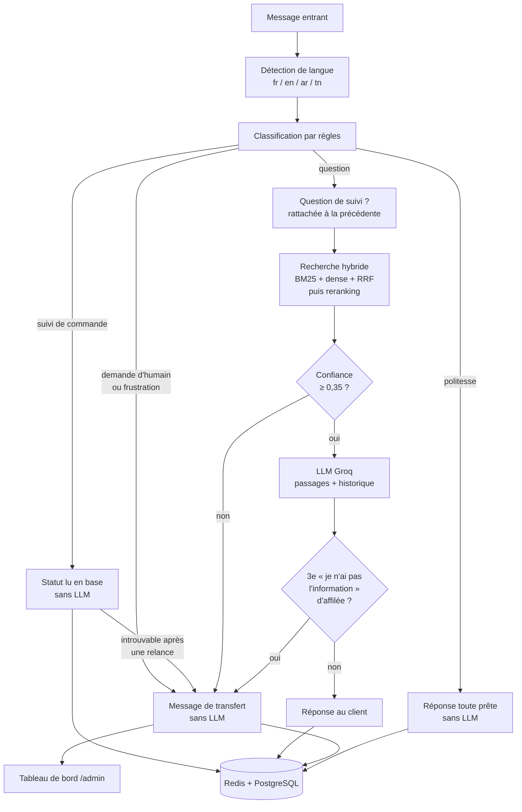

# Liss Strike — Assistant de service client multilingue (RAG)

Assistant conversationnel de service client pour **Liss Strike**, une
boutique tunisienne d'électronique et de composants pour *makers*
(cartes programmables, capteurs, modules, outillage…).

Il répond aux questions des clients en **français, anglais, arabe
littéraire et tunisien** (en lettres arabes ou en arabizi), uniquement à
partir de la base de connaissances de la boutique (pipeline **RAG**), et
transfère la conversation à un conseiller humain quand c'est nécessaire.
Les conseillers suivent les conversations transférées sur un tableau de
bord protégé.

> **Projet académique — prototype.** La base de connaissances (politiques
> SAV et catalogue produits) est **fictive**, rédigée ou générée pour le
> projet. Le système n'est pas prêt pour une mise en production en l'état
> (voir [Limites connues](#limites-connues)).

## Sommaire

- [Fonctionnalités](#fonctionnalités)
- [Architecture](#architecture)
- [Stack technique](#stack-technique)
- [Résultats mesurés](#résultats-mesurés)
- [Installation](#installation)
- [Utilisation](#utilisation)
- [Tests](#tests)
- [Structure du code](#structure-du-code)
- [Documentation](#documentation)
- [Limites connues](#limites-connues)
- [Perspectives](#perspectives)
- [Licence](#licence)

## Fonctionnalités

### Compréhension du message

- **Détection de la langue** (fr / en / ar / tn) : règles dédiées à
  l'arabe et au tunisien (y compris l'arabizi, par exemple « 3andi »),
  `langdetect` pour le reste. La langue de réponse est imposée au LLM.
- **Classification par règles** (sans LLM, donc déterministe et
  instantanée) : demande explicite d'un humain, frustration envers le
  *service* (« votre service est nul » transfère, « ce produit est nul »
  non), simple politesse (« bonjour », « merci », « au revoir »).
- **Mémoire conversationnelle** : les 6 derniers messages de la session
  sont transmis au LLM, et une question de suivi (« et quel est le
  délai ? ») est rattachée à la question précédente pour la recherche.

### Réponse (RAG « Advanced »)

- **Recherche hybride** : recherche sémantique (embeddings, ChromaDB) +
  recherche par mots-clés (BM25), fusionnées par Reciprocal Rank Fusion.
- **Reranking** des 20 meilleurs candidats par un cross-encoder
  multilingue, qui garde les 4 plus pertinents.
- **Génération** par un LLM (Groq) avec une consigne stricte : répondre
  uniquement à partir des passages trouvés, dire « je n'ai pas
  l'information » plutôt qu'inventer, refuser les questions hors sujet.

### Suivi de commande (sans LLM)

- **Statut lu en base** (table `orders`), jamais généré par le LLM : pas
  d'invention possible sur un statut, un montant ou une date. Réponse :
  numéro, statut (reçue, en préparation, expédiée, livrée, annulée),
  articles, total et date de livraison estimée, en fr / en / ar / tn.
- **Numéro de commande** : format `CMD-AAAA-NNNNN` (ex.
  `CMD-2026-00123`), reconnu quelle que soit la casse, avec tiret, espace
  ou rien entre les blocs (« cmd 2026 00123 »).
- **Détection** : un numéro valide dans le message, ou une demande sur
  *sa* commande en français ou en anglais (« où est ma commande », « suivi
  de ma commande », « where is my order », « order status »…). Les
  questions générales (« comment passer une commande ») restent traitées
  par le RAG, et une demande d'humain ou une frustration reste
  prioritaire.
- **Une seule relance** : sans numéro, ou avec un numéro introuvable, le
  bot demande de le préciser (en rappelant que le lien de suivi arrive
  par SMS et e-mail) ; si ça se reproduit juste après, ou si la base est
  indisponible, le client est transféré à un conseiller.

### Transfert vers un humain (5 déclencheurs)

| Raison | Déclencheur | Appel au LLM |
|---|---|---|
| `explicit` | Le client demande un humain | Non |
| `frustration` | Mécontentement envers le service | Non |
| `low_rag_confidence` | Confiance de la recherche sous le seuil (0,35) | Non |
| `repeated_rag_failure` | 3 réponses « je n'ai pas l'information » consécutives | Oui (réponses précédentes) |
| `order_tracking` | Commande toujours introuvable (ou sans numéro) après une relance | Non |

### Canaux et suivi

- Un seul moteur (`dialogue_manager.handle_message`) pour 4 canaux :
  HTTP, WebSocket, WhatsApp Business Cloud API, Facebook Messenger
  (signature HMAC-SHA256 des webhooks Meta vérifiée).
- **Sessions** dans Redis (1 h), **historique permanent** dans
  PostgreSQL (enregistré en arrière-plan, sans retarder la réponse).
- **Tableau de bord des conseillers** (`/admin`) : liste des
  conversations transférées (client, canal, raison, question, temps
  d'attente), historique complet de chaque conversation, **réponse au
  client** sur son canal d'origine (WhatsApp, Messenger, ou chat du site
  s'il est encore connecté), bouton « Marquer traitée », notification du
  navigateur à chaque nouveau transfert. **Un compte par conseiller**
  (HTTP Basic), rôles `conseiller` et `admin` ; chaque réponse, prise en
  main et résolution est rattachée au conseiller qui l'a faite.
- **Prise en main** : dès que le conseiller a envoyé une réponse, le bot
  ne répond plus à ce client (les messages du client restent enregistrés
  et s'affichent sur `/admin`, marqués « Pris en main »). Le bot reprend
  la main quand le conseiller clique « Marquer traitée », ou après 1 h
  sans message du conseiller (la conversation repasse alors « en
  attente » sur `/admin`). Les réponses du conseiller sont ajoutées à la
  mémoire du bot pour la suite de la conversation.
- **Interface de démonstration** (`/chat-demo`) : chat en temps réel,
  sans framework front.

## Architecture

```text
                 Client
   Web · WebSocket · WhatsApp · Messenger
                    │
       ┌────────────▼─────────────┐
       │  API FastAPI (routes)    │  signature HMAC Meta, filtre is_echo
       └────────────┬─────────────┘
       ┌────────────▼─────────────┐
       │  dialogue_manager        │  orchestration
       └──┬─────────┬─────────┬───┘
          │         │         │
  language_detector │     rag/ ─ embeddings (MiniLM, local)
  intent_classifier │          ─ ChromaDB (dense) + BM25 → RRF
                    │          ─ reranker (cross-encoder)
            session_manager    ─ LLM Groq
                 (Redis)
                    │
            PostgreSQL (users, conversations, messages)
                    │
       /admin : conversations transférées (conseillers)
```

Parcours d'un message :


```mermaid
flowchart TD
    A[Message entrant] --> B[Détection de langue<br/>fr / en / ar / tn]
    B --> C[Classification par règles]
    C -->|demande d'humain<br/>ou frustration| T[Message de transfert<br/>sans LLM]
    C -->|politesse| P[Réponse toute prête<br/>sans LLM]
    C -->|suivi de commande| O[Statut lu en base<br/>sans LLM]
    O -->|introuvable après<br/>une relance| T
    O --> DB
    C -->|question| S[Question de suivi ?<br/>rattachée à la précédente]
    S --> R[Recherche hybride<br/>BM25 + dense + RRF<br/>puis reranking]
    R --> K{Confiance<br/>≥ 0,35 ?}
    K -->|non| T
    K -->|oui| L[LLM Groq<br/>passages + historique]
    L --> F{3e « je n'ai pas<br/>l'information »<br/>d'affilée ?}
    F -->|oui| T
    F -->|non| H[Réponse au client]
    T --> D[Tableau de bord /admin]
    H --> DB[(Redis + PostgreSQL)]
    P --> DB
    T --> DB
```

## Stack technique

| Composant | Technologie |
|---|---|
| API | FastAPI (async), Uvicorn |
| LLM | Groq : `openai/gpt-oss-120b`, repli sur `openai/gpt-oss-20b` |
| Embeddings | `paraphrase-multilingual-MiniLM-L12-v2` (sentence-transformers, local, 384 dimensions) |
| Recherche lexicale | BM25 (`rank-bm25`) |
| Reranker | `cross-encoder/mmarco-mMiniLMv2-L12-H384-v1` (multilingue) |
| Base vectorielle | ChromaDB 1.4.1 (image Docker épinglée par digest) |
| Sessions | Redis 7 (repli en mémoire si indisponible) |
| Base relationnelle | PostgreSQL 16, SQLAlchemy async, Alembic |
| Détection de langue | `langdetect` + règles dédiées arabe / tunisien |
| Évaluation | RAGas 0.4.3 (`scripts/evaluate_ragas.py`) |
| Tests | pytest, pytest-asyncio |
| Infrastructure | Docker Compose (PostgreSQL, Redis, ChromaDB, Adminer) |

## Résultats mesurés

Tous les chiffres ci-dessous proviennent de
[`CHANGELOG_ADVANCED_RAG.md`](CHANGELOG_ADVANCED_RAG.md) et de
[`docs/evaluation/`](docs/evaluation/) ; le protocole et les limites de
l'évaluation y sont détaillés.

**Base de connaissances** : 11 109 chunks indexés (59 questions-réponses
de politiques SAV / e-commerce + 11 050 produits).

**Évaluation RAGas, Basic RAG vs Advanced RAG** (22 questions notées en
fr / en / ar / tn, juge `gpt-oss-20b`) :

| Métrique | Basic RAG | Advanced RAG |
|---|---|---|
| Context Precision | 0,645 | 0,913 |
| Context Recall | 0,599 | 0,800 |
| Faithfulness | 0,532 | 0,689 |
| Answer Relevancy | 0,485 | 0,600 |
| Source attendue dans le top 4 | 77 % | 95 % |

Le gain porte sur le français et l'anglais ; **l'arabe régresse** avec le
reranker (Context Recall 0,92 → 0,55). Échantillon réduit (3 à 4
questions en arabe et en tunisien) : ce sont des tendances, pas des
mesures statistiquement solides.

**Latences** (CPU, sans GPU) :

| Mesure | Valeur |
|---|---|
| Recherche Advanced (hybride + reranking), médiane sur 9 questions | 1 084 ms (max 1 505 ms) |
| dont reranking des 20 candidats | 883 ms (médiane) |
| Réponses RAG de bout en bout, scénario de démo vérifié | 1,2 à 1,9 s |
| Politesse et transfert explicite (sans LLM), même scénario | 7 à 22 ms |

## Installation

**Prérequis** : Python 3.13, Docker Desktop, une clé API
[Groq](https://console.groq.com/keys) (offre gratuite).

```bash
# 1. Dépendances
python -m venv venv
venv\Scripts\activate          # Windows (Linux/macOS : source venv/bin/activate)
pip install -r requirements.txt

# 2. Configuration : copier .env.example en .env, puis renseigner au minimum
#    GROQ_API_KEY et ADMIN_PASSWORD (sans lui, l'API refuse de démarrer)

# 3. Services (PostgreSQL, Redis, ChromaDB, Adminer)
docker compose up -d

# 4. Schéma de la base, puis indexation de la base de connaissances
alembic upgrade head
python scripts/ingest_knowledge_base.py
python scripts/seed_demo_orders.py   # optionnel : 5 commandes fictives, CMD-2026-00101 à 00105

# 5. Lancement
uvicorn app.main:app --reload
```

Au premier lancement, les modèles d'embeddings et de reranking sont
téléchargés depuis Hugging Face (le reranker pèse environ 470 Mo). Si le
téléchargement reste bloqué, définir `HF_HUB_DISABLE_XET=1`.

### Accès au tableau de bord des conseillers

Les routes `/admin/…` exposent les identifiants des clients (numéros
WhatsApp…) et leurs questions ; les routes `/users/` permettent de
lister, créer, modifier et désactiver leurs comptes. Chaque conseiller a
**son propre compte** (table `agents`, mot de passe haché avec bcrypt),
vérifié en **HTTP Basic** :

| Rôle | Accès |
|---|---|
| `conseiller` | `/admin` : liste, historique, réponse au client, prise en main, « Marquer traitée » |
| `admin` | Tout ce qui précède, plus `/users/` et la gestion des comptes conseillers (`/admin/agents`) |

**Premier compte** : au démarrage, si aucun compte n'existe, un compte
**admin** est créé à partir de `ADMIN_USERNAME` / `ADMIN_PASSWORD`
(`.env`) :

```env
ADMIN_USERNAME=admin
ADMIN_PASSWORD=un-vrai-mot-de-passe
```

- Ces deux variables ne servent **qu'à cette création** : ensuite, les
  comptes vivent en base, et modifier `ADMIN_PASSWORD` dans `.env` n'a
  plus d'effet (changer le mot de passe par l'API, ci-dessous). L'API
  refuse de démarrer si aucun compte n'existe et que `ADMIN_PASSWORD`
  est absent.
- **Gestion des comptes** (rôle `admin`, depuis `/docs` ou curl ; pas
  d'écran dédié) : `GET` / `POST /admin/agents` (lister, créer),
  `POST /admin/agents/{id}/deactivate` et `/activate`,
  `PUT /admin/agents/{id}/password`. Le dernier admin actif ne peut pas
  être désactivé. Mot de passe : 8 caractères minimum, 72 octets
  maximum (limite de bcrypt).
- **Traçabilité** : chaque réponse enregistre le conseiller qui l'a
  envoyée (affiché dans l'historique de `/admin`), la prise en main et
  « Marquer traitée » enregistrent aussi leur auteur. Un compte
  désactivé ne peut plus se connecter, mais son historique est conservé.
- Le navigateur affiche sa propre invite de connexion à l'ouverture de
  `/admin` ; l'en-tête indique le conseiller connecté. HTTP Basic n'a pas
  de vraie déconnexion : pour changer de compte, fermer le navigateur.
  Les identifiants sont transmis encodés (base64), non chiffrés :
  **HTTPS indispensable** en dehors d'une machine locale.

### Origines autorisées (CORS)

Seules les origines listées dans `CORS_ALLOWED_ORIGINS` (séparées par des
virgules) peuvent appeler l'API depuis un navigateur. Sans cette
variable, ce sont `http://localhost:8000` et `http://127.0.0.1:8000`.
La même liste s'applique au WebSocket `/ws/{client_id}` : une connexion
dont l'en-tête `Origin` n'y figure pas (ou qui n'en a pas) est fermée
avec le code 1008.

- `/chat-demo` et `/admin` ouverts en local (`localhost:8000` ou
  `127.0.0.1:8000`) : aucune configuration nécessaire.
- Pour une page ouverte depuis une autre adresse, **y compris
  `/chat-demo` exposé via ngrok** (son WebSocket envoie alors l'origine
  ngrok), ajouter cette origine exacte (schéma, domaine, port, sans `/`
  final) :

```env
CORS_ALLOWED_ORIGINS=http://localhost:8000,https://xxxx.ngrok-free.app
```

### WhatsApp en conditions réelles

Testé de bout en bout avec un vrai téléphone : message reçu par le
webhook (signature vérifiée), réponse du bot générée puis envoyée par
l'API Graph et reçue sur WhatsApp. Configuration utilisée : **numéro de
test fourni par Meta**, un seul destinataire autorisé, serveur local
exposé par ngrok (voir
[`docs/webhooks_ngrok_setup.md`](docs/webhooks_ngrok_setup.md)).

Conditions nécessaires (en plus de l'URL du webhook, du jeton de
vérification et de l'abonnement au champ `messages` dans l'application
Meta) :

- **`WHATSAPP_APP_SECRET`** : le secret de l'application Meta, recopié
  exactement (32 caractères hexadécimaux). Valeur erronée : chaque
  message reçu est rejeté en 403 (signature invalide). **Absent** alors
  que le canal est configuré (`WHATSAPP_PHONE_NUMBER_ID`,
  `WHATSAPP_ACCESS_TOKEN` ou `WHATSAPP_VERIFY_TOKEN`) : l'API **refuse de
  démarrer** ; et sans lui, le webhook refuse toute requête (aucun
  message n'est jamais accepté sans signature vérifiée).
- **Application abonnée au compte WhatsApp Business (WABA)** : étape
  distincte des champs webhook de l'application, faite par l'API Graph
  (`POST /{id-du-WABA}/subscribed_apps`, vérifiable par un `GET` sur la
  même adresse). Sans elle, les messages réels n'arrivent jamais au
  webhook, alors que le bouton « Test » du tableau de bord fonctionne.
- **`WHATSAPP_ACCESS_TOKEN`** : jeton de l'application, avec la
  permission `whatsapp_business_messaging` ; **`WHATSAPP_PHONE_NUMBER_ID`**
  : identifiant du numéro qui envoie.
- **En développement** : le numéro de test ne peut écrire qu'aux
  destinataires ajoutés **et validés** dans la configuration de l'API.
  Jeton invalide ou destinataire non autorisé : erreur Meta `131005`
  (« Access denied »), réponse du bot non délivrée.

Limites actuelles :

- **Jeton d'accès temporaire** (environ 24 h) : passé ce délai, les
  réponses ne partent plus. Un utilisateur système avec jeton permanent
  est nécessaire pour un usage durable (pas encore fait).
- **API Graph en version `v18.0`** : ancienne mais fonctionnelle ; la
  mise à jour vers une version récente n'est pas encore faite.

### Ne jamais utiliser `docker compose down -v`

L'option `-v` supprime les volumes Docker nommés : la base de
connaissances indexée dans ChromaDB (il faudrait relancer
`ingest_knowledge_base.py`, plusieurs minutes) et toutes les données
PostgreSQL seraient perdues.

```bash
docker compose stop     # arrête les conteneurs, garde tout (recommandé)
docker compose down     # supprime les conteneurs ; les volumes nommés
                        # (chroma_data, postgres_data) sont conservés
```

## Utilisation

| Adresse | Rôle |
|---|---|
| http://localhost:8000/chat-demo | Interface de démonstration (chat en temps réel) |
| http://localhost:8000/admin | Tableau de bord des conseillers (identifiants requis) |
| http://localhost:8000/docs | Documentation interactive de l'API (Swagger) |
| http://localhost:8080 | Adminer (administration PostgreSQL) |

Points d'entrée de l'API :

| Canal / usage | Route |
|---|---|
| Web (HTTP) | `POST /chat/` |
| Web (temps réel) | `GET /chat/session` (identifiant signé), puis `WS /ws/{client_id}?signature=…` |
| WhatsApp Business Cloud API | `GET` / `POST /webhook/whatsapp` |
| Facebook Messenger | `GET` / `POST /webhook/messenger` |
| Conseillers | `GET /admin`, `GET /admin/me`, `GET /admin/escalations`, `GET /admin/escalations/{id}/messages`, `POST /admin/escalations/{id}/reply`, `POST /admin/escalations/{id}/resolve` |
| Comptes conseillers (rôle admin) | `GET` / `POST /admin/agents`, `POST /admin/agents/{id}/deactivate`, `/activate`, `PUT /admin/agents/{id}/password` |
| Utilisateurs (CRUD, identifiants requis) | `/users/` |
| Supervision | `GET /health` |

Exemple :

```bash
curl -X POST http://localhost:8000/chat/ \
  -H "Content-Type: application/json" \
  -d '{"message": "Quels sont les frais de livraison ?", "channel": "web"}'
```

La réponse contient le texte, l'identifiant de session attribué par le
serveur et sa signature (`session_id`, `session_signature`, à renvoyer
tous deux pour continuer la conversation ; un `session_id` sans
signature valide est refusé en 403), l'intention, la confiance, les sources consultées, le temps de
traitement et, le cas échéant, la raison du transfert.

**Démonstration** : un scénario vérifié en 8 étapes, une checklist de
démarrage et une transcription de secours sont dans
[`docs/demo/`](docs/demo/).

## Tests

```bash
pytest tests/ -v
```

**460 tests** : détection de langue, classification (escalade,
politesse, faux positifs), recherche hybride et reranking, mémoire
conversationnelle, compteur de boucle RAG, orchestrateur complet (les 4
types de transfert), suivi de commande, persistance PostgreSQL, tableau de bord `/admin`
(historique, réponse au client, prise en main),
authentification de `/admin` et `/users/`, restriction CORS et origine
du WebSocket, séparation des sessions web / WhatsApp, limitation de débit, structure de
la base de connaissances.

- Les tests d'intégration ont besoin des services (`docker compose up
  -d`), d'une base de connaissances indexée et d'une clé Groq ; sans eux,
  ils sont ignorés (*skipped*).
- Certains tests appellent réellement Groq (consommation du quota
  gratuit) et les tests de l'orchestrateur écrivent des conversations
  dans la base PostgreSQL locale.

## Structure du code

```text
app/
├── main.py                    # application FastAPI, préchargement des modèles
├── config.py                  # configuration (variables d'environnement)
├── api/routes/                # chat, websocket, whatsapp, messenger, users, admin
├── services/
│   ├── dialogue_manager.py    # orchestrateur : langue, règles, RAG, LLM, persistance
│   ├── intent_classifier.py   # transfert, frustration, politesse (règles)
│   ├── language_detector.py   # fr / en / ar / tn
│   ├── session_manager.py     # sessions Redis
│   └── rag/                   # embeddings, ChromaDB, BM25, reranker, LLM
├── db/, models/, schemas/     # PostgreSQL (SQLAlchemy) et schémas Pydantic
alembic/                       # migrations de la base
data/knowledge_base/           # politiques SAV (.txt) et catalogue produits (.csv)
scripts/                       # ingestion, génération de données, calibration, évaluation RAGas
static/                        # chat.html (démo client), admin.html (conseillers)
tests/                         # suite pytest (460 tests)
docs/                          # démo, évaluation RAGas, webhooks, captures d'écran
```

## Documentation

- [`CHANGELOG_ADVANCED_RAG.md`](CHANGELOG_ADVANCED_RAG.md) : passage au
  RAG avancé (recherche hybride, reranking, calibration, évaluation
  RAGas), correctifs après revue et anomalies documentées (symptôme,
  diagnostic, cause, correction).
- [`data/knowledge_base/README.md`](data/knowledge_base/README.md) :
  contenu et format de la base de connaissances, ré-indexation.
- [`docs/demo/`](docs/demo/) : scénario de démonstration, checklist du
  jour J, transcription vérifiée.
- [`docs/evaluation/`](docs/evaluation/) : résultats RAGas détaillés
  (JSON et Markdown).
- [`docs/webhooks_ngrok_setup.md`](docs/webhooks_ngrok_setup.md) :
  exposer le serveur local en HTTPS et configurer les webhooks
  WhatsApp / Messenger.
- [`docs/screenshots/`](docs/screenshots/) : captures d'écran.
  `admin_1_liste.png` et `admin_2_apres_resolution.png` montrent le
  tableau de bord des conseillers ; les captures `chat_demo_*` et
  `figure27` à `figure29` sont antérieures aux derniers correctifs de
  l'interface de démonstration.

## Limites connues

### Relais humain

- **Réponse depuis `/admin`** : envoyée sur le canal d'origine, et
  enregistrée seulement si l'envoi a réussi. Sinon, le conseiller voit
  l'erreur exacte (« Message NON envoyé ») :
  - **WhatsApp / Messenger** : impossible sans identifiants Meta
    (`WHATSAPP_*`, `MESSENGER_*`). Les fonctions d'envoi simulent alors
    l'envoi sans erreur ; la route le détecte et répond 409. Sur
    WhatsApp, la fonction d'envoi a été testée en réel pour les réponses
    du bot, mais **pas encore depuis `/admin`** ; Messenger n'a jamais
    été testé avec un vrai compte. Règle des 24 h de WhatsApp non gérée.
  - **Chat du site** : le client n'est joignable que tant que son onglet
    `/chat-demo` reste ouvert (connexion WebSocket, dans le même
    processus serveur). Onglet fermé, serveur redémarré ou client venu
    par `POST /chat/` : 409, aucun moyen de le recontacter.
- **Prise en main** :
  - elle ne commence qu'avec un envoi **réussi** : sur WhatsApp et
    Messenger, sans identifiants Meta, le conseiller ne peut donc pas
    prendre la main (le bot continue de répondre) ;
  - pendant la prise en main, le client ne reçoit **rien** (ni réponse
    du bot, ni accusé de réception) : sans réponse du conseiller, il
    attend jusqu'à 1 h avant que le bot reprenne ;
  - aucune alerte quand le client écrit pendant la prise en main : son
    message apparaît dans la liste et l'historique (actualisés toutes
    les 10 s), sans notification ;
  - le statut est lu dans PostgreSQL avant chaque réponse (6 à 10 ms par
    message, mesuré en local). Si PostgreSQL est indisponible, le bot
    répond comme si personne n'avait pris la main.
- Les notifications ne fonctionnent que si l'onglet `/admin` est ouvert
  (notifications du navigateur) : pas d'e-mail ni de notification push.

### Sécurité

- **Journaux sans données personnelles ni secrets** :
  - journal SQL **désactivé par défaut** (`SQL_ECHO=false`) ; même activé
    pour déboguer, les requêtes s'affichent sans leurs valeurs (ni
    messages, ni numéros) ;
  - identifiants de session masqués (`216…21` pour un numéro WhatsApp),
    texte des messages jamais journalisé (seulement en base) ;
  - valeurs des paramètres sensibles masquées dans les journaux d'uvicorn
    et de httpx (`hub.verify_token`, `access_token` de Messenger,
    signature de session WebSocket), erreurs d'envoi Meta sans URL (ni
    dans les journaux, ni dans les messages d'erreur de `/admin`) ;
  - journal DEBUG de Groq (qui contient la conversation envoyée au LLM)
    plafonné au niveau INFO.

  Les journaux produits **avant** ces corrections peuvent en contenir :
  à supprimer s'ils ont été conservés.
- `/admin` et `/users/` : un compte par conseiller, deux rôles
  seulement (`conseiller`, `admin`), sans permissions plus fines ni
  journal des connexions (voir
  [Accès au tableau de bord](#accès-au-tableau-de-bord-des-conseillers)).
  Les tentatives de connexion ne sont pas limitées : l'authentification
  est vérifiée avant la limitation de débit, donc les essais de mot de
  passe refusés (401) ne sont pas comptés, et `/admin` n'a pas de limite.
- Les routes `/chat/` et `/ws/{client_id}`, destinées aux clients, n'ont
  **aucune authentification**. Une **limitation de débit par adresse
  IP** freine les abus (épuisement du quota Groq, appels en boucle) sans
  les empêcher :

  | Route | Limite par IP (défaut) | Justification |
  |---|---|---|
  | `POST /chat/` | 20 requêtes / minute | Un client humain envoie quelques messages par minute ; chaque message coûte un appel Groq. |
  | `WS /ws/{client_id}` | 5 connexions simultanées, 20 messages / minute (toutes connexions confondues) | Quelques onglets ouverts ; même budget que `/chat/`. |
  | `/users/` (toutes routes) | 10 requêtes / minute, compteur commun (requêtes authentifiées) | Aucun usage légitime en rafale ; l'interface de démo ne l'appelle pas. |

  Au-delà : réponse **429** avec un message explicite (HTTP), ou
  message d'erreur puis fermeture de la connexion avec le code 1008
  (WebSocket). Les valeurs se règlent dans `.env` (`RATE_LIMIT_CHAT`,
  `RATE_LIMIT_WS_MESSAGES`, `RATE_LIMIT_WS_CONNECTIONS`,
  `RATE_LIMIT_USERS`). Limites de ce mécanisme :
  - compteurs en mémoire, propres au processus : remis à zéro au
    redémarrage, non partagés entre plusieurs workers ;
  - derrière un proxy (ngrok…), tous les visiteurs ont l'adresse du
    proxy et partagent donc la même limite (l'en-tête
    `X-Forwarded-For`, falsifiable, n'est pas lu) ;
  - un attaquant disposant de nombreuses adresses IP n'est pas freiné ;
  - les webhooks WhatsApp et Messenger ne sont pas limités : ils sont
    authentifiés par leur signature HMAC. WhatsApp exige
    `WHATSAPP_APP_SECRET` (sans lui, requêtes refusées et démarrage
    impossible si le canal est configuré) ; Messenger vérifie la
    signature seulement si `MESSENGER_APP_SECRET` est défini (sinon, il
    l'accepte sans vérification).
- La restriction des origines (CORS pour HTTP, vérification de
  l'en-tête `Origin` pour `/ws/{client_id}`) protège les visiteurs
  contre un site tiers ouvert dans leur navigateur. Elle ne bloque pas
  un client hors navigateur (curl, script), qui peut envoyer l'en-tête
  `Origin` de son choix.
- Les identifiants de session des canaux web sont préfixés en interne
  par `web:` : un client web ne peut pas rejoindre une session WhatsApp
  (numéro de téléphone) ou Messenger (PSID).
- **WebSocket** : l'identifiant est **attribué et signé par le serveur**
  (`GET /chat/session`, HMAC-SHA256 avec `WS_SESSION_SECRET`) ;
  `/ws/{client_id}` refuse avec le code 1008 un identifiant sans sa
  signature. Un client ne peut donc ni choisir son identifiant, ni
  reprendre celui d'un autre en le devinant. Sans `WS_SESSION_SECRET`,
  la clé est aléatoire et propre au processus : les sessions ouvertes
  sont invalidées au redémarrage (recharger la page), et plusieurs
  processus serveur exigent de définir la clé. La signature ne protège
  pas un identifiant **déjà connu** avec sa signature (par exemple
  copié depuis le navigateur de la victime).
- **`POST /chat/`** : même mécanisme. Sans `session_id`, le serveur en
  attribue un et renvoie sa `session_signature` ; un `session_id` envoyé
  sans signature valide est refusé en 403. Même clé que `/ws` : une
  session de `GET /chat/session` vaut aussi pour `POST /chat/`. Mêmes
  limites (clé éphémère sans `WS_SESSION_SECRET`, identifiant déjà connu
  avec sa signature). Par ailleurs, le champ
  `channel` de `POST /chat/` est déclaratif : une conversation web peut
  apparaître sous le canal « WhatsApp » dans `/admin` (l'identifiant du
  client y commence alors par `web:`).

### Mise en production

- **WhatsApp** : testé en conditions réelles avec le numéro de test de
  Meta et un seul destinataire (voir
  [WhatsApp en conditions réelles](#whatsapp-en-conditions-réelles)) ;
  jeton d'accès temporaire, pas encore de numéro de production ni de
  gestion de la fenêtre de 24 h. **Messenger** : jamais testé avec une
  vraie Page, seulement avec des requêtes simulées au format exact.
- Pas de `Dockerfile` pour l'API ni d'intégration continue ; les
  webhooks passent par ngrok en local.
- Dépendance à l'offre gratuite de Groq (quota de tokens par jour et par
  modèle).
- **Suivi de commande sur données fictives** : aucune intégration avec
  une vraie boutique en ligne ; les commandes viennent de
  `scripts/seed_demo_orders.py` (supprimées par `cleanup_test_data.py`
  avec le client de démo `test-demo-client`). Le numéro de commande est
  la seule clé : quiconque le connaît voit le statut, les articles et le
  total (aucune donnée personnelle), et les numéros sont séquentiels,
  donc devinables. Tournures détectées en français et en anglais
  seulement (en arabe ou en tunisien, il faut donner le numéro).

### Langues et qualité des réponses

- **Anglais → français** : la base est rédigée en français ; certaines
  questions en anglais ne retrouvent pas la bonne politique (« What is
  the warranty on programmable boards? » échoue, « What is the warranty
  on a multimeter? » réussit).
- **Arabe** : le reranker fait baisser le rappel (voir
  [Résultats mesurés](#résultats-mesurés)).
- **Tunisien en arabizi** : le contenu de la réponse est correct, mais
  elle est souvent rédigée en arabe littéraire plutôt qu'en arabizi.
- **Notations techniques et arabizi** : un chiffre collé à des lettres
  est un marqueur d'arabizi (« 3andi »). Les unités et notations
  courantes (« 5V », « 3D », « 2K », « 5MP », « 2m », « 16x2 »…) sont
  exclues par une liste fermée : une notation absente de cette liste
  peut encore faire répondre le bot en tunisien.
- Le compteur de boucle RAG reconnaît les réponses « je n'ai pas
  l'information » par mots-clés : une formulation inédite du LLM n'est
  pas comptée.
- Le seuil de confiance (0,35) arrête surtout les questions **hors
  domaine** ; il isole rarement les questions du domaine mal couvertes
  par la base (catalogue très large). Les deux mécanismes contre le
  hors-sujet (seuil et consigne du LLM) se recouvrent en partie.

### Suite de tests

- Les tests de l'orchestrateur laissent des conversations dans la base
  locale et consomment le quota Groq ; tests unitaires et d'intégration
  ne sont pas séparés.

## Perspectives

- Notifications hors navigateur (e-mail, push) ; écran de gestion des
  comptes conseillers dans `/admin`, connexion par session plutôt que
  HTTP Basic.
- Authentification des clients sur l'API.
- Reranking réservé au français et à l'anglais (la mesure RAGas montre
  la régression en arabe) ; normalisation de l'arabizi avant la
  recherche.
- `Dockerfile`, intégration continue, séparation des tests unitaires et
  d'intégration.
- Suivi de commande relié à un back-office.

## Licence

Projet académique. Aucune licence open source n'est définie à ce jour
(pas de fichier `LICENSE`).
